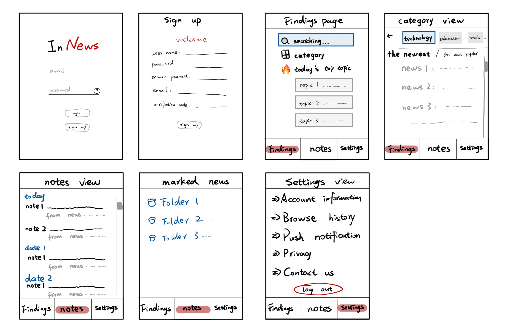

# InNews: Your industry news assistant

An application that is based on the APIs of multiple reliable news sources, combined with GPT's natural language processing capabilities to extract key information, enable users to effortlessly access the most current industry information and gain insights into emerging industry trends.

## Use this README File 

Use this

## Storyboard


 

## Installation

Method 1: Download the apk and install into your android phone https://github.com/zzzzwow/InNews/releases/tag/v1.5.0 

Method 2: clone this repository, open and run the under instructions with emulator:

```
flutter pub get
```

```
flutter run
```


##  Contact Details

Having Contact Details is also If you have any question, please contact author via email: qijingzeng03@gmail.com 
